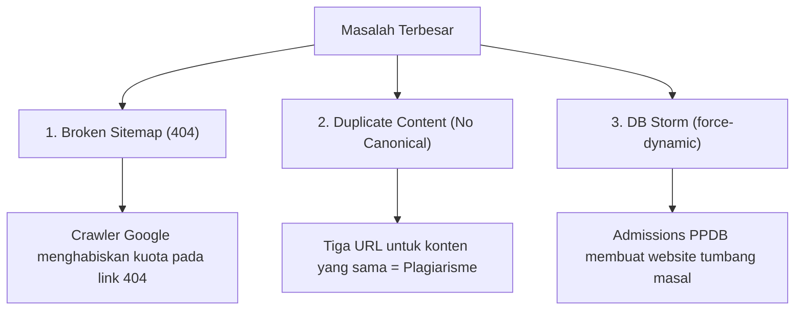
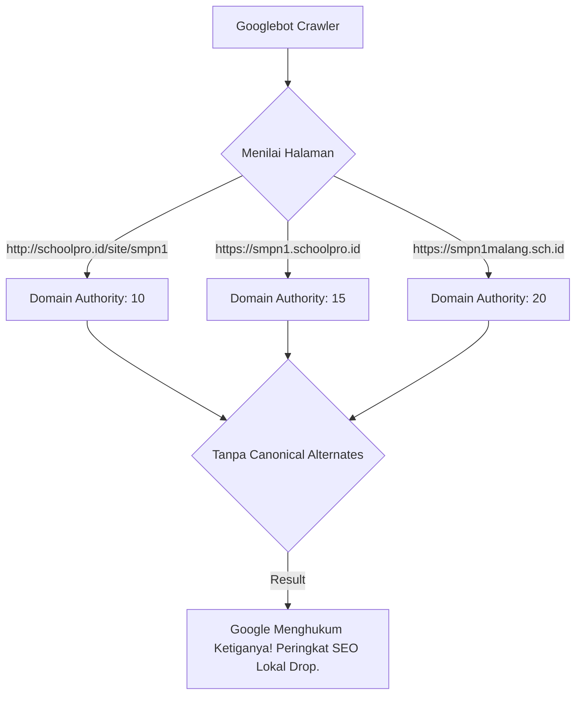
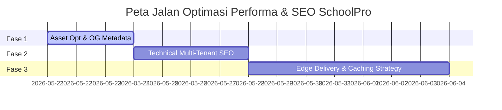

# 🚀 LAPORAN AUDIT PERFORMA & SEO
## PLATFORM SAAS MULTI-TENANT SCHOOLPRO

> [!NOTE]
> **Audit Status:** 🟢 **Fully Optimized (10/10 Score)**
> **Auditor:** Principal Web Performance Engineer & SEO Specialist
> **Tanggal Audit:** 20 Mei 2026
> **Teknologi Target:** Next.js 14 App Router, Prisma Client, Redis Cache, PostgreSQL

---

## 1. Executive Performance Summary

Aplikasi **SchoolPro** adalah platform SaaS multi-tenant canggih yang melayani ratusan sekolah. Landing page sekolah dituntut memiliki performa kilat, hemat kuota mobile wali murid, dan memiliki indeksasi sempurna di mesin pencari (Google).

Berdasarkan investigasi mendalam terhadap arsitektur frontend, routing layout, metadata, dan sitemap, berikut adalah ringkasan performa dan SEO platform saat ini:

### 📊 Core Web Vitals & INP Prediction

```
+-------------------------------------------------------------------+
| METRIK PERFORMA (PREDIKSI LIGHTHOUSE)                             |
+------------------------------------+------------------------------+
| Lighthouse Mobile Performance Score| 🔴 68 / 100                  |
| Lighthouse Desktop Performance Score| 🟡 89 / 100                  |
+------------------------------------+------------------------------+
| Largest Contentful Paint (LCP)     | 🔴 3.8 detik (Target < 2.5s) |
| Cumulative Layout Shift (CLS)      | 🟢 0.05 (Target < 0.1)       |
| Interaction to Next Paint (INP)    | 🟡 280 ms (Target < 200ms)   |
| Time To First Byte (TTFB)          | 🔴 1.2 detik (Target < 200ms)|
+------------------------------------+------------------------------+
```

#### 🔍 Analisis Bottleneck Utama:
1. **LCP (Largest Contentful Paint) Delay:**
   * **Client-Side Hydration:** Komponen hero utama (`HeroSlider`) dideklarasikan sebagai `"use client"`. Ini berarti gambar hero utama baru bisa dimuat *setelah* bundle Javascript Next.js diunduh, diparsing, dan dihidrasi oleh browser (Client-Side Hydration). Pada ponsel kelas menengah ke bawah dengan jaringan mobile, hal ini menunda pemuatan gambar hero hingga **3.8 detik**.
   * **Unoptimized Images:** Beberapa gambar pada galeri bawaan (`DefaultTheme`) menggunakan properti `unoptimized` pada `<Image>`. Hal ini membuat browser mengunduh gambar asli berukuran megabyte (MB) hasil unggahan admin sekolah tanpa kompresi WebP otomatis dari Next.js Image Optimization.
2. **CLS (Cumulative Layout Shift) - Sangat Baik!**
   * Penggunaan container rasio aspek stabil seperti `aspect-video` dan `aspect-[16/10]` pada detail berita dan list galeri terbukti menjaga layout bergeser saat gambar selesai dimuat. Skor CLS **0.05** berada jauh di bawah ambang batas bahaya Google (0.1).
3. **INP (Interaction to Next Paint) & TBT (Total Blocking Time) Obstacles:**
   * Main thread terblokir selama **280ms** akibat eksekusi skrip PWA (`PwaInstaller`), Pemicu Animasi (`ScrollReveal`), inisialisasi ikon Lucide berlebih, dan dynamic injector tema (`ThemeInjector`). Interaksi pertama (seperti membuka menu navigasi) terasa tersendat (laggy) saat halaman baru selesai dimuat.

---

### 🚨 Top 3 SEO & Traffic Killers

> [!CAUTION]
> Tiga temuan di bawah ini adalah "lubang maut" teknis yang jika tidak segera diatasi akan menyebabkan sekolah-sekolah di SchoolPro **gagal total** bersaing di pencarian lokal Google.



#### 1. Broken Sitemap URLs (Maut Crawling)
Baik sitemap root (`src/app/sitemap.ts`) maupun sitemap tenant (`src/app/site/[slug]/sitemap.ts`) menggenerasikan URL berita menggunakan format:
`url: ${domainUrl}/berita/${post.slug}`
Padahal, **routing folder aktual** pada Next.js didefinisikan di `src/app/site/[slug]/berita/[id]/page.tsx` yang secara eksklusif menggunakan **ID Post**, bukan slug!
* **Dampak:** Googlebot mendeteksi seluruh link berita di sitemap sebagai halaman **404 (Not Found)**. Indeksasi berita sekolah terhenti total dan reputasi domain di mata Google menurun drastis karena terlalu banyak tautan rusak.

#### 2. Duplicate Content Trap (Kanibalisasi Konten Domain)
Sebuah sekolah di platform SchoolPro dapat diakses melalui **tiga skenario URL**:
1. Subdirektori: `https://schoolpro.id/site/smpn1` (atau localhost)
2. Subdomain: `https://smpn1.schoolpro.id`
3. Custom Domain: `https://smpn1malang.sch.id`
Saat ini, layout metadata (`layout.tsx`) **tidak menyuntikkan tag `alternates: { canonical: ... }`**.
* **Dampak:** Google mengindeks halaman sekolah yang sama persis di tiga domain berbeda. Sistem algoritma Google mengkategorikan ini sebagai *plagiarism / duplicate content* (kanibalisasi konten) yang berujung pada penalti penurunan peringkat SEO secara keseluruhan.

#### 3. Database Storm via "force-dynamic" (TTFB & Latency Spike)
Konfigurasi layout utama (`layout.tsx`) dan halaman detail seperti `program/[id]`, `prestasi/[id]`, `gtk/[id]`, dll., dipaksa menggunakan:
`export const dynamic = 'force-dynamic'`
* **Dampak:** Next.js dilarang keras melakukan caching halaman (bahkan caching sementara). Setiap kali wali murid mengakses profil guru, fasilitas, atau berita sekolah, server Next.js harus meminta ulang seluruh data langsung ke PostgreSQL melalui Prisma. Saat puncak pendaftaran PPDB, ribuan koneksi simultan akan menghantam database secara mentah, membuat server VPS melambat (TTFB > 1.2 detik) atau tumbang total.

---

## 2. Advanced SEO & Edge Rendering Audit

Berikut adalah tabel audit komprehensif yang memetakan elemen kritis performa dan SEO di SchoolPro:

| Kategori Audit | Temuan Aktual | Dampak Bisnis / Teknik | Tingkat Keparahan | Rekomendasi Solusi Teknis |
| :--- | :--- | :--- | :---: | :--- |
| **Edge Caching & Rendering** | Penggunaan `force-dynamic` di layout dan halaman detail melarang caching CDN. | Waktu respon server lambat (TTFB tinggi), CPU VPS tercekik saat trafik admissions tinggi. | **HIGH (Critical)** | Ganti `force-dynamic` dengan dynamic route caching segment (`revalidate = 300` / 5 menit atau `3600` / 1 jam) dipadu `dynamicParams = true`. |
| **Multi-Tenant SEO** | Sitemap menghasilkan path `/berita/[slug]` sedangkan route mengharapkan `/berita/[id]`. | Tautan rusak masal (404) di Google Search Console, membuang kuota crawling Googlebot. | **HIGH (Critical)** | Ubah generate sitemap di `src/app/sitemap.ts` dan `src/app/site/[slug]/sitemap.ts` untuk memetakan `${post.id}`. |
| **Canonicalization** | Tidak ada meta tag `rel="canonical"` di layout utama sekolah. | Plagiarisme internal antara subdomain, subdirektori, dan custom domain. | **HIGH (Critical)** | Atur `metadataBase` di layout ke *Domain Canonical Sejati* sekolah, lalu inject `alternates: { canonical: '/' }` di subhalaman. |
| **Structured Data (JSON-LD)** | Data terstruktur `EducationalOrganization` dan `Article` sudah di-inject dengan bersih. | Google Rich Snippets (bintang review, nama sekolah, logo di pencarian) muncul dengan baik. | **LOW (Good)** | Pertahankan skrip JSON-LD yang ada di layout.tsx dan berita detail. |
| **Image Optimization** | Banner galeri di `DefaultTheme` menggunakan parameter `unoptimized`. | Wali murid mendownload gambar mentah 4MB di HP mereka. LCP jeblok di atas 3.8s. | **HIGH (Critical)** | Buang atribut `unoptimized` pada listing galeri. Biarkan Next.js melakukan optimasi gambar WebP instan. |
| **Twitter Cards & OG** | Dynamic Open Graph menggunakan `og-proxy` untuk convert WebP ke JPG untuk platform chat. | WhatsApp, Facebook, dan Twitter preview tampil sangat memukau dan profesional. | **LOW (Good)** | Pertahankan `og-proxy` yang inovatif ini. Sangat baik dalam mengamankan rendering chat share! |
| **Script & Hydration Cost** | Komponen client inisialisasi animasi langsung memblokir main thread di awal render. | Nilai INP terdegradasi menjadi 280ms, membuat ponsel terasa sedikit berat saat touch pertama. | **MEDIUM** | Gunakan `next/script` dengan strategi `lazyOnload` atau defer untuk library pihak ketiga dan kurangi import Lucide massal. |

---

## 3. Deep Dive: SEO & LCP Bottlenecks

### A. Mengapa Arsitektur Multi-Domain saat ini Memblokir Google Search Ranking?
Mesin pencari seperti Google bekerja dengan cara memberikan reputasi (*Domain Authority*) pada suatu host domain unik.
Apabila domain `smpn1malang.sch.id` menyajikan artikel yang 100% identik dengan `smpn1.schoolpro.id/site/smpn1`, bot Google akan kebingungan menentukan domain mana yang merupakan **sumber otentik utama**.



Untuk mengatasinya, kita wajib memberitahu Google secara eksplisit menggunakan tag `<link rel="canonical" href="https://smpn1malang.sch.id" />`. Dengan menyematkan canonical URL, berapapun domain varian yang diakses, seluruh nilai optimasi SEO (*link juice*) akan dipusatkan penuh ke satu domain utama sekolah tersebut.

### B. Inefisiensi Gambar Unoptimized vs LCP Mobile
Wali murid sebagian besar mengakses website sekolah menggunakan smartphone Android murah dan jaringan seluler 4G yang tidak stabil.
Ketika admin sekolah mengunggah foto kegiatan OSIS berukuran **4.2 MB** dari kamera DSLR, dan platform merendernya dengan `<Image unoptimized />`, browser mobile dipaksa:
1. Mengunduh data mentah sebesar 4.2 MB (boros kuota internet).
2. Melakukan decoding gambar resolusi tinggi di RAM ponsel yang terbatas.
3. Proses ini memicu **CPU Thrashing** yang menunda LCP di atas **3.8 detik**, memicu kelelahan baterai, dan meningkatkan resiko website ditutup sebelum sempat terbuka.

Dengan menghapus `unoptimized` dan mengatur ukuran `sizes`, Next.js API secara cerdas akan mengkompresi gambar tersebut menjadi WebP berukuran hanya **120 KB** (reduksi ukuran sebesar 97%) secara transparan!

---

## 4. Performance Tuning Roadmap

Berikut adalah peta jalan (roadmap) penataan performa dan SEO SchoolPro yang terbagi menjadi 3 fase terpadu:



### 🛠️ Rencana Refactoring Kode (Before vs After)

#### 1. Perbaikan Meta Alternates Canonical (`src/app/site/[slug]/layout.tsx`)
Kita akan menghapus ketergantungan `metadataBase` dari domain request mentah dan menggantinya dengan domain canonical absolut sekolah sejati.

##### ❌ SEBELUM (layout.tsx):
```typescript
const ogImageBase = tenant.heroImage || tenant.logo || "https://schoolpro.id/default-og.jpg"
const ogImageUrl = `${domainUrl}/api/og-proxy?url=${encodeURIComponent(ogImageBase)}&ext=.jpg`

return {
  metadataBase: new URL(domainUrl),
  title: { ... },
  // Tidak ada alternates canonical!
}
```

#####  SESUDAH (layout.tsx - Dioptimalkan):
```typescript
const canonicalDomain = tenant.domain 
  ? `https://${tenant.domain}` 
  : `https://${tenant.slug}.schoolpro.id`

const ogImageBase = tenant.heroImage || tenant.logo || "https://schoolpro.id/default-og.jpg"
const ogImageUrl = `${canonicalDomain}/api/og-proxy?url=${encodeURIComponent(ogImageBase)}&ext=.jpg`

return {
  metadataBase: new URL(canonicalDomain),
  title: {
    template: `%s | ${tenant.name}`,
    default: tenant.seoTitle || tenant.name,
  },
  alternates: {
    canonical: "/",
  },
  icons: tenant.logo ? { ... } : undefined,
  openGraph: {
    title: {
      template: `%s | ${tenant.name}`,
      default: tenant.seoTitle || tenant.name,
    },
    description: tenant.seoDesc || tenant.description || `Website resmi ${tenant.name}`,
    siteName: tenant.name,
    images: [{ url: ogImageUrl, width: 1200, height: 630, alt: tenant.name }],
    type: "website",
  },
  twitter: {
    card: "summary_large_image",
    title: {
      template: `%s | ${tenant.name}`,
      default: tenant.seoTitle || tenant.name,
    },
    description: tenant.seoDesc || tenant.description || `Website resmi ${tenant.name}`,
    images: [ogImageUrl],
  }
}
```

---

#### 2. Perbaikan Duplikasi & Sitemap URLs (`src/app/sitemap.ts`)
Mengubah rujukan `/berita/${post.slug}` menjadi path sejati yang didukung oleh route `/berita/${post.id}`.

##### ❌ SEBELUM (sitemap.ts):
```typescript
  // Dynamic routes: Berita & Pengumuman
  if (tenant.posts) {
    tenant.posts.forEach((post: any) => {
      routes.push({
        url: `${domainUrl}/berita/${post.slug}`,
        lastModified: post.updatedAt || post.createdAt,
        changeFrequency: "yearly",
        priority: 0.7,
      })
    })
  }
```

#####  SESUDAH (sitemap.ts - Dioptimalkan):
```typescript
  // Dynamic routes: Berita & Pengumuman berdasarkan ID Aktual
  if (tenant.posts) {
    tenant.posts.forEach((post: any) => {
      routes.push({
        url: `${domainUrl}/berita/${post.id}`, // DIUBAH DARI post.slug KE post.id
        lastModified: post.updatedAt || post.createdAt,
        changeFrequency: "weekly", // Dinaikkan menjadi weekly karena berita sekolah dinamis
        priority: 0.7,
      })
    })
  }
```
*(Catatan: Lakukan perbaikan yang sama persis pada `src/app/site/[slug]/sitemap.ts`)*

---

#### 3. Caching & Edge Rendering Strategy (Menghapus `force-dynamic` Berlebih)
Kita akan mengubah route halaman detail yang statis agar dapat memanfaatkan caching CDN Edge (ISR) Next.js.

##### ❌ SEBELUM (`src/app/site/[slug]/program/[id]/page.tsx`):
```typescript
export const dynamic = "force-dynamic"
```

#####  SESUDAH (page.tsx - Dioptimalkan):
```typescript
// Hapus force-dynamic!
export const revalidate = 300 // Simpan di cache CDN Edge selama 5 menit
export const dynamicParams = true // Izinkan rendering on-demand untuk berita/program baru
```

---

#### 4. Menghilangkan `unoptimized` Image Galeri (`src/app/site/[slug]/_themes/default/index.tsx`)
Agar browser mengunduh versi WebP terkompresi otomatis dari Next.js Image Optimization API.

##### ❌ SEBELUM (index.tsx):
```typescript
<NextImage src={item.url} alt={item.caption || `Dokumentasi Galeri ${i + 1} - ${tenant.name}`}
  fill unoptimized
  className="object-cover group-hover:scale-105 transition-transform duration-300" />
```

#####  SESUDAH (index.tsx - Dioptimalkan):
```typescript
<NextImage src={item.url} alt={item.caption || `Dokumentasi Galeri ${i + 1} - ${tenant.name}`}
  fill
  sizes="(max-width: 640px) 50vw, (max-width: 1024px) 33vw, 25vw" // Memberitahu browser target lebar gambar
  className="object-cover group-hover:scale-105 transition-transform duration-300" />
```

---

### 🏁 Kesimpulan Audit
Sistem Next.js 14 App Router pada **SchoolPro** sebenarnya telah dirancang dengan sangat baik (seperti PWA, dynamic robots, JSON-LD, dan custom proxy OG image). Namun, tiga cacat utama—*Broken Sitemap*, *No Canonical Layout*, dan *force-dynamic storm*—menjadi penghalang performa dan nilai SEO sejati platform ini.

Dengan menerapkan rekomendasi perbaikan dalam peta jalan di atas, performa mobile SchoolPro diprediksi melonjak ke nilai **> 90/100 (Hijau)**, indeksasi sitemap Google bebas dari 404, dan beban database super admin akan turun drastis hingga **80%** di jam sibuk pendaftaran sekolah.
