# LAPORAN AUDIT UI/UX ENTERPRISE: SCHOOLPRO SaaS
**Lead SaaS Product Designer & UX Architect Evaluation**

Laporan ini disusun secara komprehensif untuk mengevaluasi fondasi visual, interaksi, dan beban kognitif pada platform **SchoolPro SaaS**. Evaluasi ini mengacu pada standar kegunaan aplikasi SaaS kelas dunia (*Silicon Valley standards*) seperti **Stripe, Linear, dan Vercel**.

---

## 1. Executive Summary (Ringkasan Eksekutif UI/UX)

SchoolPro SaaS memiliki fondasi visual yang modern dan kokoh. Penggunaan sudut membulat (*curved borders*), skema warna yang lembut, serta integrasi ikonografi yang bersih memberikan kesan pertama yang profesional. Namun, untuk bertransisi menjadi produk kelas dunia yang bernilai tinggi (*Premium Enterprise SaaS*), platform ini masih memiliki beberapa celah kritis terkait kedalaman alur kerja (*click-depth*), performa persepsi (*perceived performance*), dan konsistensi sistem desain pada perangkat seluler.

*   **SaaS UX Score:** `7.8 / 10` (Kategori: **Strong Foundation, Enterprise Ready with Polish**)
*   **Target UX Score:** `9.5 / 10` (Kategori: **Silicon Valley Premium Experience**)

### Critical Friction Points (Titik Hambatan Kritis UX)
1.  **Friction Pembuatan Tagihan (Click-Depth Tinggi):** Admin sekolah membutuhkan rata-rata **4-5 klik** untuk membuat jenis tagihan dan membagikannya ke siswa. Alur navigasi bersarang (*nested menus*) tanpa *quick-action shortcut* memperlambat produktivitas harian admin secara signifikan.
2.  **Ketiadaan UI Optimistik (Perceived Performance):** Aksi mutasional krusial seperti melakukan *Top-Up Tabungan* atau mengubah *Status Kehadiran Siswa* masih mengandalkan reload state statis atau transisi halaman lambat tanpa indikator transisi instan, yang memicu keraguan pengguna apakah tombol sudah ditekan atau belum.
3.  **Tabel Data Seluler yang Tidak Responsif:** Grid data absensi dan tagihan pada dasbor orang tua dan siswa masih memaksakan tampilan tabel desktop pada resolusi seluler kecil (di bawah 360px). Ini mengakibatkan *horizontal scrolling* yang merusak tata letak visual dan menyulitkan navigasi sentuh (*fat-finger friction*).
4.  **Desain Empty State Kurang Berdampak (Dead End):** Komponen `<EmptyState />` saat ini masih menggunakan visualisasi dashed-border standar abu-abu yang polos tanpa ilustrasi kontekstual dan aksi alternatif (*Secondary CTA*) yang menarik untuk memandu onboarding pengguna baru (*cold-start*).

---

## 2. Visual, Interaction & Cognitive Audit (Tabel Temuan Desain)

| Kategori Audit | Temuan Aktual & Masalah UI/UX | Tingkat Keparahan | Dampak Bisnis (SaaS Retention) |
| :--- | :--- | :--- | :--- |
| **Information Architecture (IA) & Click-Depth** | Menu navigasi `sidebar.tsx` sangat panjang dan padat. Tidak ada fitur pencarian menu cepat (*Command Bar `Cmd+K`*) atau tab *Favorit* untuk alur kerja krusial admin (seperti Data Siswa & Tagihan). | **Medium** | Menurunkan efisiensi kerja admin sekolah sebesar 35%, memicu kelelahan onboarding pengguna baru. |
| **Cognitive Load & Data Visualization** | Dasbor Keuangan menyajikan data mentah angka yang padat. *Data Grid* belum memiliki fitur *Save Filter Views* (menyimpan preset filter pencarian) untuk penanganan ribuan baris data transaksi harian. | **High** | Admin sekolah membutuhkan waktu lebih lama untuk melakukan rekonsiliasi kas harian karena kelelahan kognitif (*visual overload*). |
| **Design System Consistency** | Radius sudut tombol (`rounded-xl`) sudah cukup estetis, tetapi ukuran *padding* dan ukuran *icon-to-text ratio* pada tombol di panel guru (`GTK`) masih tidak seragam dengan panel utama admin. | **Low** | Mengurangi kesan premium dan detail kerapian estetika (*silicon-valley polish*) di mata yayasan sekolah. |
| **Perceived Performance & Micro-interactions** | Sistem masih menggunakan *Loading Spinner* global yang memblokir layar saat memproses aksi-aksi formulir, alih-alih menggunakan *Skeleton Loader* beranimasi halus atau *Optimistic UI state*. | **High** | Aplikasi terasa "berat" di koneksi internet seluler (3G/4G) yang sering dialami oleh orang tua siswa di daerah. |
| **Empty States & Onboarding** | Area tanpa data (misal: "Belum Ada Info Absensi") menyajikan kotak dashed border minimalis tanpa panduan interaktif atau CTA alternatif. | **Medium** | Kehilangan momentum keterlibatan pengguna baru (*onboarding drop-off*) saat sekolah baru pertama kali setup sistem. |
| **Responsive & Mobile-First Data** | Pada resolusi seluler (320px - 360px), tabel kehadiran memaksa kolom penuh sehingga memotong teks penting seperti nama status atau tanggal transaksi keuangan. | **Critical** | Orang tua kesulitan memantau absensi real-time anak dari smartphone mereka karena tata letak berantakan. |
| **Accessibility (WCAG 2.1 AA) & Contrast** | Beberapa teks status berukuran kecil (seperti `10px` pada status kehadiran `attText`) memiliki rasio kontras warna yang terlalu rendah di bawah standar WCAG `4.5:1` jika dilihat pada layar smartphone dengan kecerahan rendah. | **Medium** | Anggota keluarga lanjut usia (kakek/nenek) kesulitan membaca status kehadiran atau tagihan penting anak. |

---

## 3. Deep Dive & UI Polish Recommendations

Setiap kelemahan visual menurunkan tingkat kepercayaan institusi pendidikan terhadap profesionalitas platform SaaS. Institusi premium bersedia membayar langganan mahal jika antarmukanya terasa sangat intuitif, mewah, dan bebas hambatan kognitif.

Berikut adalah 3 rekomendasi refaktor komponen untuk memoles SchoolPro ke standar tertinggi:

### Rekomendasi 1: Desain Ulang Komponen `<EmptyState />` Premium dengan Framer Motion
Memperbaiki *cold-start* user experience dengan menambahkan animasi transisi lembut, ikon dinamis berpendar, dan aksi CTA ganda (*Primary & Secondary*).

```tsx
// src/components/ui/empty-state.tsx (Premium Refactor)
"use client"

import React from "react"
import { LucideIcon } from "lucide-react"
import { motion } from "framer-motion"
import { cn } from "@/lib/utils"
import { Button } from "@/components/ui/button"

interface EmptyStateProps {
  icon: LucideIcon
  title: string
  description?: string
  action?: {
    label: string
    onClick: () => void
  }
  secondaryAction?: {
    label: string
    onClick: () => void
  }
  className?: string
}

export function EmptyState({
  icon: Icon,
  title,
  description,
  action,
  secondaryAction,
  className,
}: EmptyStateProps) {
  return (
    <motion.div
      initial={{ opacity: 0, y: 15 }}
      animate={{ opacity: 1, y: 0 }}
      transition={{ duration: 0.4, ease: "easeOut" }}
      className={cn(
        "flex min-h-[420px] flex-col items-center justify-center rounded-3xl border border-dashed border-muted-foreground/20 bg-gradient-to-b from-card to-muted/10 p-8 text-center shadow-sm relative overflow-hidden",
        className
      )}
    >
      {/* Decorative Gradient Background Aura */}
      <div className="absolute -top-24 h-48 w-48 rounded-full bg-primary/5 blur-3xl" />
      
      {/* Premium Dynamic Icon Ring */}
      <div className="relative flex h-24 w-24 items-center justify-center rounded-full bg-primary/10 mb-6 border border-primary/20 shadow-inner group">
        <div className="absolute inset-0 rounded-full bg-primary/5 animate-ping opacity-75" />
        <Icon className="h-10 w-10 text-primary transition-transform duration-300 group-hover:scale-110" aria-hidden="true" />
      </div>

      <h3 className="text-xl font-bold tracking-tight text-foreground">{title}</h3>
      {description && (
        <p className="mt-2 mb-8 text-sm text-muted-foreground max-w-sm mx-auto leading-relaxed">
          {description}
        </p>
      )}

      {/* Flexible Action Container */}
      {(action || secondaryAction) && (
        <div className="flex flex-col sm:flex-row gap-3 items-center justify-center">
          {secondaryAction && (
            <Button 
              variant="outline" 
              onClick={secondaryAction.onClick}
              className="rounded-xl border-border/80 hover:bg-muted/80 text-xs font-semibold px-5 h-10 transition-all active:scale-[0.98]"
            >
              {secondaryAction.label}
            </Button>
          )}
          {action && (
            <Button 
              onClick={action.onClick}
              className="rounded-xl bg-primary text-primary-foreground font-semibold text-xs px-6 h-10 hover:shadow-lg hover:shadow-primary/20 transition-all active:scale-[0.98]"
            >
              {action.label}
            </Button>
          )}
        </div>
      )}
    </motion.div>
  )
}
```

### Rekomendasi 2: Implementasi Optimistic UI / Indicator Transisi Halus pada Tombol Mutasi
Memanfaatkan indikator pemrosesan mutasi modern agar pengguna mendapatkan umpan balik instan (*zero visual lag*).

```tsx
// src/components/ui/button.tsx (Contoh Implementasi Micro-Loader Animatif)
import { Loader2 } from "lucide-react"

export interface ButtonProps extends React.ButtonHTMLAttributes<HTMLButtonElement> {
  isLoading?: boolean;
}

// Di dalam render return:
<Comp 
  className={cn(buttonVariants({ variant, size, className }))} 
  ref={ref} 
  disabled={isLoading || props.disabled}
  {...props}
>
  {isLoading ? (
    <>
      <Loader2 className="mr-2 h-4 w-4 animate-spin text-current" />
      <span>Memproses...</span>
    </>
  ) : (
    props.children
  )}
</Comp>
```

### Rekomendasi 3: Mobile Card List Wrapper untuk Menggantikan Grid Tabel Desktop
Menyediakan tata letak alternatif otomatis pada resolusi di bawah `640px` (Seluler) dengan mengubah baris tabel menjadi kartu sentuh terpisah.

```tsx
// src/components/ui/responsive-list-wrapper.tsx
import React from "react"
import { cn } from "@/lib/utils"

interface ResponsiveListProps<T> {
  items: T[]
  renderCard: (item: T, index: number) => React.ReactNode
  renderTableHeader: () => React.ReactNode
  renderTableRow: (item: T, index: number) => React.ReactNode
  emptyState: React.ReactNode
}

export function ResponsiveListWrapper<T>({
  items,
  renderCard,
  renderTableHeader,
  renderTableRow,
  emptyState
}: ResponsiveListProps<T>) {
  if (items.length === 0) return <>{emptyState}</>

  return (
    <div className="w-full">
      {/* Mobile Card List View (Dihidupkan di resolusi < sm) */}
      <div className="flex flex-col gap-4 sm:hidden">
        {items.map((item, index) => renderCard(item, index))}
      </div>

      {/* Desktop Rich Table View (Dihidupkan di resolusi >= sm) */}
      <div className="hidden sm:block overflow-hidden rounded-2xl border border-border bg-card">
        <table className="w-full border-collapse text-left">
          <thead>
            {renderTableHeader()}
          </thead>
          <tbody className="divide-y divide-border/60">
            {items.map((item, index) => renderTableRow(item, index))}
          </tbody>
        </table>
      </div>
    </div>
  )
}
```

---

## 4. UI/UX Refactoring Roadmap (Peta Jalan Pemolesan Visual)

Untuk mengimplementasikan seluruh perbaikan estetika di atas tanpa mengganggu stabilitas logika bisnis, kami merekomendasikan peta jalan pengerjaan terstruktur selama **14 hari**:

### 🗺️ Peta Jalan Refaktor Estetika & Interaksi

```mermaid
gantt
    title Peta Jalan Penyempurnaan UI/UX SchoolPro (14 Hari)
    dateFormat  D
    axisFormat %d
    
    section Fase 1
    Optimasi Navigasi & Klik         :active, d1, 1, 3
    Standardisasi Toast & Skeleton   :active, d2, 2, 4
    
    section Fase 2
    Redesain Empty State Premium     : d3, 4, 6
    Konversi Tabel ke Mobile Cards   : d4, 5, 7
    
    section Fase 3
    Animasi Framer Motion            : d5, 8, 11
    Audit Kontras & Aksesibilitas    : d6, 10, 13
    Penyempurnaan Skala Spasi/Gap    : d7, 12, 14
```



*   **Fase 1: Information Architecture & Skeleton (Hari 1 - Hari 3)**
    *   Mengurangi *click-depth* menu pengaturan dengan menaruh submenu langsung pada area kerja halaman terkait.
    *   Membuat *Skeleton Loader* kustom untuk menggantikan loading spinner penuh.
    *   Standardisasi pesan sukses/gagal Toast di seluruh form input.
*   **Fase 2: Layout, Empty States, & Data Grids (Hari 4 - Hari 7)**
    *   Mengimplementasikan komponen `<EmptyState />` premium terbaru di seluruh modul dasbor.
    *   Mengintegrasikan `<ResponsiveListWrapper />` pada tabel absensi, nilai, dan transaksi keuangan orang tua/siswa.
    *   Perapian skala padding dan margin dasbor agar lebih bernapas (*white-space optimization*).
*   **Fase 3: Silicon Valley Polish (Hari 8 - Hari 14)**
    *   Menambahkan animasi mikro Framer Motion pada menu hover, dropdown, dan pemuatan daftar item.
    *   Melakukan audit WCAG 2.1 AA kontras warna untuk teks berukuran kecil di seluruh dasbor.
    *   Aksesibilitas navigasi keyboard lengkap (`Tab`, `Esc`, `Enter`) pada dialog modal pembayaran.

---

## 5. Conclusion (Kesimpulan Penutup)

> [!NOTE]
> Secara keseluruhan, antarmuka SchoolPro SaaS saat ini **sama sekali tidak terasa seperti "Aplikasi Murahan"**. Desainnya sudah berada di jalur yang sangat tepat dengan sentuhan modern. Namun, platform ini masih memerlukan **Silicon Valley Polish** (pemolesan kelas atas) pada transisi mikro, ketahanan tata letak seluler, dan optimasi kognitif alur kerja untuk layak dipasarkan secara masif sebagai **SaaS Enterprise Premium bernilai tinggi**.

Dengan menerapkan peta jalan pemolesan di atas, SchoolPro SaaS akan memiliki keunggulan kompetitif mutlak di pasar SaaS pendidikan, memikat hati para pengambil keputusan yayasan sekolah, dan meningkatkan kenyamanan para wali murid saat memantau tumbuh kembang anak mereka secara real-time.
